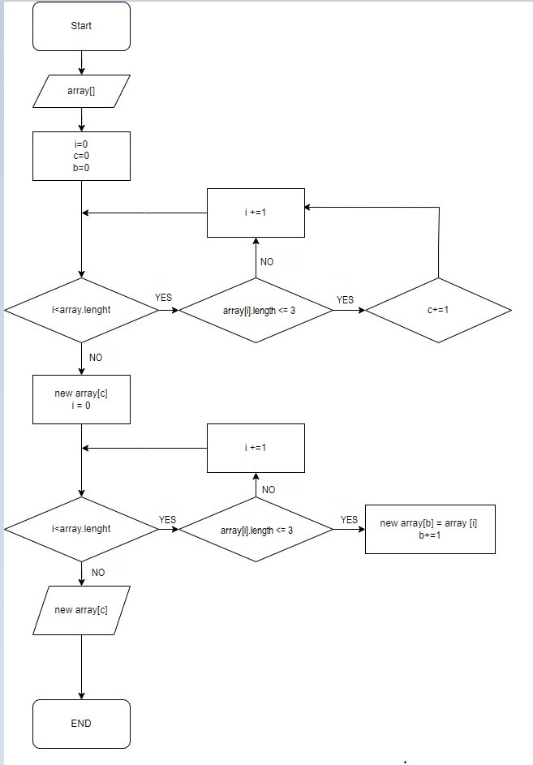

# Oписание работы кода

## Шаг 1: Начало программы

Программа начинается с вызова основного блока, который запускает выполнение последовательных операций.

## Шаг 2: Метод CreateArray()

Этот метод выполняет две основные функции:

1 Определение размера массива.

2 Запрос значений каждого элемента массива.

### Запрос размер массива: 
*Программа запрашивает у пользователя, какого размера массив нужно создать. Это может быть выполнено с помощью ввода с клавиатуры.*

+ Цикл по размеру массива: Программа запускает цикл, который будет выполнять операции ввода для каждого элемента массива. 
+ Запрос каждого элемента: Внутри цикла программа запросит у пользователя значение для каждого элемента массива. В конце метод возвращает созданный массив.

## Шаг 3: Показать созданный массив 

*Метод ShowArray(arrayNew) выводит созданный массив на экран. Таким образом, пользователь видит, какие данные включены в массив.*

## Шаг 4: Метод ResultArray() Этот метод выполняет две основные задачи:

* Подсчет элементов массива, значение которых меньше или равно 3.*
* Создание нового массива, содержащего только эти элементы. Программа проходит по каждому элементу массива и увеличивает счетчик каждый раз, когда находит элемент, значение которого меньше или равно 3.
* Цикл по массиву: Программа выполняет второй цикл, чтобы создать новый массив. Копировать элементы <= 3: Внутри этого цикла программа добавляет в новый массив только те элементы, которые соответствуют условию <= 3. В конце метод возвращает новый массив.

## Шаг 5: Показать новый массив После выполнения всех операций программа, вероятно, покажет результат – новый массив, содержащий элементы, значение которых меньше или равно 3.

Kогика кода:

*Создание массива, основываясь на вводе пользователя. Вывод исходного массива. Создание нового массива, содержащего только элементы, соответствующие критерию (<= 3). Вывод нового массива.*

# Блок схема кода:

